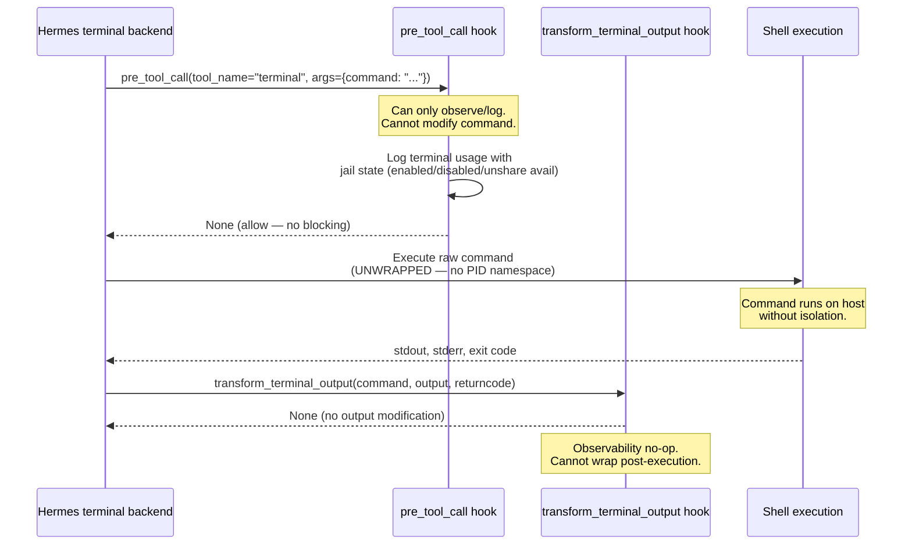
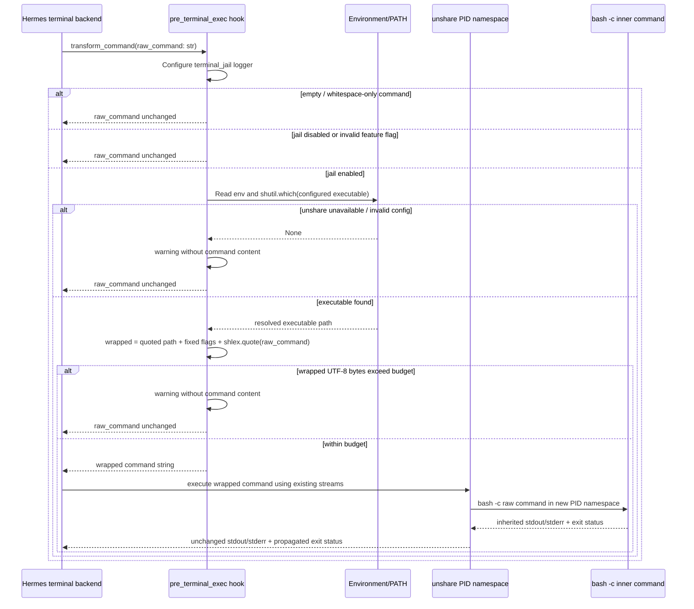

# Terminal Jail Hermes Plugin Specification

## 0. HOOK GAP NOTICE — Critical Architecture Constraint (2026-07-20)

Hermes core does NOT expose a pre-execution command-transform hook. The plugin's `transform_command()` and `transform_exec_command()` functions (167 lines, fully tested, 75 passing tests) are ready to wrap terminal commands in PID namespaces — but there is no hook to wire them into before execution.

**What exists in Hermes core:**
- `pre_tool_call` — Can only BLOCK or ALLOW tool calls. Cannot modify command strings.
- `transform_terminal_output` — Fires AFTER execution. Can transform output, not the command.

**What does NOT exist:**
- A `pre_terminal_exec` or `command_transform` hook that receives the command string and returns a modified command.

**What this means for terminal-jail v1.0.0:**
- The wrapping functions (`transform_command`, `transform_exec_command`) exist, are importable, and are tested.
- The plugin provides **observability only** — it registers `pre_tool_call` (logs terminal usage) and `transform_terminal_output` (no-op).
- Commands are NOT actually wrapped in PID namespaces at execution time.

**Resolution paths (see tasks board):**
1. **HOOK-GAP-01:** Build `pre_terminal_exec` or `command_transform` hook in Hermes core — allows modifying command string before execution.
2. **HOOK-GAP-02:** Wrap at terminal backend layer — modify the terminal tool's execution path directly.
3. **HOOK-GAP-03:** systemd sandbox as sole isolation — accept that PID namespace wrapping lives entirely in the systemd layer (Phase 5), plugin provides observability only.
4. **T4.8 (partial workaround):** `--sandbox` flag was implemented in Hermes core fork (commit `40ae3f6e1`, branch `fix/cron-repeat-int-format`, repo `totalwindupflightsystems/hermes-agent`) but not merged upstream. That flag adds `terminal.jail_enabled` config key and wraps at the config layer rather than the plugin layer.

**Sections below describe the wrapping functions as designed.** The algorithm, configuration schema, exit status behavior, and test matrix are all accurate for `transform_command()`/`transform_exec_command()`. The hook registration (Section 4) and sequence diagram (Section 10) reflect the actual register()-based plugin with observability hooks.

---

## 1. Purpose and scope

Implement a Hermes Agent plugin named `terminal-jail` that, when a pre-execution command-transform hook becomes available in Hermes core, isolates every terminal command in a Linux PID namespace. It is a command-string transformation plugin only: it does not execute subprocesses, capture output, emulate shell behavior, alter timeouts, or rewrite exit statuses.

The plugin converts a raw command string into a shell command that starts a PID namespace using `unshare`. It must use this exact outer command shape:

```text
unshare --pid --fork --mount-proc --kill-child=SIGKILL bash -c <shell-quoted-original-command>
```

The plugin protects the host process namespace from command behavior such as `kill`, `pkill`, `killall`, and uncontrolled descendants. The `--kill-child=SIGKILL` option ensures namespace children are killed when the namespace init exits.

**Current status (v1.0.0):** The wrapping functions are implemented and tested but NOT wired to command execution. See Section 0 for the hook gap. The plugin provides terminal usage observability only.

This plugin is Linux-only. It must gracefully pass commands through unchanged if `unshare` is unavailable, if the feature is disabled, or if the command is empty/whitespace-only.

Non-goals:

- It does not provide filesystem, mount, network, user, cgroup, seccomp, capability, or container isolation.
- It does not parse or validate the inner shell command.
- It does not add pipes, redirects, `eval`, a wrapper shell around the command, logging commands, output capture, or an explicit `exit` command.
- It does not make unsafe commands safe outside the PID namespace.
- It does not bypass the terminal backend's normal command execution or output streaming.

## 2. Required package layout and imports

Create this package layout:

```text
terminal-jail/
├── __init__.py
└── plugin.py
```

The repository-level plugin directory is the directory containing `terminal-jail/__init__.py`. The code must use only the Python standard library.

**Plugin discovery:** Hermes discovers the plugin through a `register(ctx)` function in `__init__.py`. The `ctx` object provides `ctx.register_hook(hook_name, callable)` for registering hooks. This differs from the earlier `hooks` dict export pattern — Hermes calls `register()` at plugin load time.

Required imports in `terminal_jail/plugin.py`:

```python
from __future__ import annotations

import logging
import os
import shlex
import shutil
from typing import Final
```

Do not import Hermes internals in `plugin.py`. Hermes discovers the hook callables through the `register()` function exported by `terminal_jail/__init__.py`.

## 3. Exact public Python interfaces

`terminal_jail/plugin.py` must export these exact functions. Do not add positional parameters, keyword-only parameters, `*args`, `**kwargs`, or alternate return types.

```python
def transform_command(command: str) -> str:
    """Transform a generic Hermes terminal command into a PID-namespace command."""


def transform_exec_command(command: str) -> str:
    """Transform a Hermes terminal exec-path command into a PID-namespace command."""
```

Both hook signatures accept the raw terminal command exactly as supplied by Hermes and return a command string for Hermes to execute.

`transform_exec_command()` must delegate directly to `transform_command(command)` and return its result. It must not duplicate wrapping or independently inspect the environment. This guarantees that both hooks have precisely the same behavior and prevents accidental double wrapping if the hook pipeline invokes only one hook per command as required by Hermes.

Implementation contract:

```python
def transform_exec_command(command: str) -> str:
    return transform_command(command)
```

The callable must never return `None`, bytes, a list/tuple, a subprocess result, a shell AST, or a command array. Any internally unexpected failure must fail open: emit one warning with exception information and return the original `command` unchanged.

## 4. Plugin metadata and hook registration (actual implementation)

The plugin uses Hermes' `register()` pattern. `terminal_jail/__init__.py` has this structure:

```python
from __future__ import annotations

import logging
from typing import Any

from .terminal_jail.plugin import (
    _configure_logger,
    _enabled_from_environment,
    _unshare_executable_from_environment,
    transform_command,
    transform_exec_command,
)

logger = logging.getLogger(__name__)


def _on_pre_tool_call(
    tool_name: str = "",
    args: Any = None,
    **kwargs: Any,
) -> None:
    """Observer: log terminal tool usage for observability.

    This fires before every tool call. We can only observe/log — we cannot
    transform the command here (the hook only supports block/allow).
    """
    if tool_name != "terminal":
        return

    command = args.get("command", "") if isinstance(args, dict) else ""
    jail_enabled = _enabled_from_environment()
    unshare_available = _unshare_executable_from_environment() is not None

    if jail_enabled and unshare_available:
        logger.info(
            "terminal-jail: observed terminal command (%d bytes); "
            "pre-execution wrapping is unavailable",
            len(command),
        )
    elif jail_enabled and not unshare_available:
        logger.warning(
            "terminal-jail: jail enabled but unshare not found; "
            "running command without isolation"
        )
    elif not jail_enabled:
        logger.debug("terminal-jail: disabled, passing through")


def _on_transform_terminal_output(
    command: str,
    output: str,
    returncode: int,
    **kwargs: Any,
) -> str | None:
    """Transform terminal output — primarily observability.

    Since we can't inject the jail prefix pre-execution, this is a no-op
    placeholder. Returns None to leave output unchanged.
    """
    return None


def register(ctx) -> None:
    """Register terminal-jail hooks with the Hermes plugin system."""
    ctx.register_hook("pre_tool_call", _on_pre_tool_call)
    ctx.register_hook("transform_terminal_output", _on_transform_terminal_output)

    logger.info(
        "terminal-jail v0.1.0 loaded. "
        "NOTE: pre-execution command wrapping requires Hermes core "
        "pre-execution hooks (see task HOOK-GAP-01). "
        "Observability hooks registered."
    )


__all__ = [
    "register",
    "transform_command",
    "transform_exec_command",
]
```

Requirements for this metadata:

1. The plugin MUST export a `register(ctx)` function — Hermes calls this at plugin load time.
2. Available Hermes hooks (v0.1.0): `pre_tool_call` (block/allow only), `transform_terminal_output` (post-exec output transform).
3. `transform_command` and `transform_exec_command` are public and importable but NOT wired to any hook — no pre-execution command-transform hook exists in Hermes core.
4. Keep `__init__.py` free of executable setup work, environment probing, subprocess calls, and logging configuration beyond the `register()` invocation.

**Future state (when HOOK-GAP-01 is resolved):** When Hermes adds a pre-execution command-transform hook (e.g., `pre_terminal_exec`), the `register()` function will additionally call:
```python
ctx.register_hook("pre_terminal_exec", transform_command)
```

## 5. Input-to-output contract

### 5.1 Normal enabled behavior

Given a non-empty command string, with the jail enabled and a usable `unshare` found on `PATH`, return:

```python
"unshare --pid --fork --mount-proc --kill-child=SIGKILL bash -c " + shlex.quote(command)
```

`command` is passed to `shlex.quote()` as one whole string. This is mandatory. Never interpolate the raw command directly into the outer command.

Examples:

| Raw input `command` | Required returned string |
|---|---|
| `echo hello` | `unshare --pid --fork --mount-proc --kill-child=SIGKILL bash -c 'echo hello'` |
| `false` | `unshare --pid --fork --mount-proc --kill-child=SIGKILL bash -c false` |
| `printf '%s\\n' "a b"` | `unshare --pid --fork --mount-proc --kill-child=SIGKILL bash -c 'printf '"'"'%s\\n'"'"' "a b"'` |
| `echo "$(id)"; echo done` | `unshare --pid --fork --mount-proc --kill-child=SIGKILL bash -c 'echo "$(id)"; echo done'` |

The exact punctuation of `shlex.quote()` output is authoritative. Tests should compare against an expected string built using `shlex.quote(raw_command)`, rather than hand-recreating complex quoting.

### 5.2 What is and is not quoted

The prefix below is a literal fixed string and is not shell-quoted:

```text
unshare --pid --fork --mount-proc --kill-child=SIGKILL bash -c 
```

The sole dynamic component is the original raw command. It is shell-quoted exactly once using `shlex.quote(command)`.

Do not quote individual command tokens. Do not call `split()`, `shlex.split()`, or `subprocess.list2cmdline()`. Do not add quotes around the `unshare` executable, option names, `bash`, or `-c`. Do not prepend `exec`; doing so can change process and signal behavior. Do not add shell pipes, `tee`, `stdbuf`, `script`, command substitution, heredocs, or redirections.

### 5.3 Disabled or unavailable behavior

Return the original input string byte-for-byte (as a Python `str`) in each of these cases:

1. `command == ""`.
2. `command` contains only Unicode whitespace, determined by `not command.strip()`.
3. `$HERMES_TERMINAL_JAIL_ENABLED` disables the plugin.
4. `$HERMES_TERMINAL_JAIL_COMMAND` resolves to an empty value.
5. The configured `unshare` executable cannot be found with `shutil.which()`.
6. The length guard determines that the wrapped command would exceed the configured command-size budget.
7. An unexpected exception occurs in transformation code.

The raw command must be returned unchanged. In particular, whitespace-only inputs must not be normalized, stripped, or converted to an empty string.

## 6. Configuration schema

All configuration is read at each hook invocation. Do not cache environment-derived settings: this makes tests deterministic under `monkeypatch` and allows a running Hermes process to observe environment changes.

| Environment variable | Type / accepted values | Default | Meaning |
|---|---|---|---:|---|
| `HERMES_TERMINAL_JAIL_ENABLED` | case-insensitive boolean: `1`, `true`, `yes`, `on` enable; `0`, `false`, `no`, `off`, empty disable | `true` | Feature flag. Any unrecognized non-empty value must disable the jail and log a warning. Fail closed with respect to configuration ambiguity, but fail open for command execution. |
| `HERMES_TERMINAL_JAIL_COMMAND` | executable name or path | `unshare` | Program to locate and invoke. Intended for injected test doubles and nonstandard installations. It must be treated as one executable token, not as a shell fragment containing arguments. |
| `HERMES_TERMINAL_JAIL_MAX_COMMAND_BYTES` | positive base-10 integer | `131072` | Maximum UTF-8 encoded byte length allowed for the returned wrapped command. This is a conservative preflight budget below typical Linux `ARG_MAX`; it prevents a transformation from creating an obviously oversized shell argument. |
| `HERMES_TERMINAL_JAIL_LOG_LEVEL` | standard Python logging level name | `WARNING` | Logger level for `terminal_jail`. Apply only to this plugin logger; do not call `logging.basicConfig()` or change root logger configuration. Invalid values leave the logger at `WARNING` and log one warning. |

No other environment variables are supported. Do not read an `.env` file, a configuration file, or the current working directory.

### 6.1 Boolean parsing

Implement a private helper with this exact signature:

```python
def _enabled_from_environment() -> bool:
```

Rules:

- Missing variable means enabled.
- Values are `strip()`ped and compared case-insensitively.
- Truthy set: `{ "1", "true", "yes", "on" }`.
- Falsey set: `{ "", "0", "false", "no", "off" }`.
- Any other value is invalid, must emit a warning naming the variable and its repr, and returns `False`.

### 6.2 Configured executable validation

Implement a private helper with this exact signature:

```python
def _unshare_executable_from_environment() -> str | None:
```

Rules:

- Read `HERMES_TERMINAL_JAIL_COMMAND`; default to `"unshare"`.
- Strip surrounding whitespace.
- If the resulting string is empty, log a warning and return `None`.
- Reject a value containing a NUL character (`"\x00"`): log a warning and return `None`.
- Reject a value containing any shell whitespace: log a warning and return `None`. This prevents configuration such as `"unshare --user"` from injecting unreviewed flags.
- Return `shutil.which(configured_value)` when found; otherwise return `None`.

When a configured program is found by `shutil.which`, use the returned resolved path as the executable token in the transformed command. Quote that resolved executable with `shlex.quote()` only if it contains shell-special characters or whitespace. The cleanest required construction is:

```python
prefix = (
    f"{shlex.quote(unshare_path)} --pid --fork --mount-proc "
    "--kill-child=SIGKILL bash -c "
)
return prefix + shlex.quote(command)
```

With the default command and normal PATH resolution, `shutil.which("unshare")` commonly returns `/usr/bin/unshare`; therefore tests must not assume the literal executable portion is `unshare` unless they inject `shutil.which` or put a test executable named `unshare` first on `PATH`. The semantic required format is the resolved executable followed by the exact fixed flags and `bash -c`.

### 6.3 Command-byte budget parsing

Implement a private helper with this exact signature:

```python
def _max_command_bytes_from_environment() -> int:
```

Rules:

- Missing variable returns `131072`.
- Parse using `int(value, 10)` after stripping whitespace.
- Values less than or equal to zero, non-integers, and invalid values must log a warning and return `131072`.
- The byte length check is `len(wrapped_command.encode("utf-8"))`.
- If encoding unexpectedly raises, log with exception info and return the raw command unchanged.

This is a preflight guard, not a claim that an arbitrary command below the budget cannot exceed the host's true `execve(2)` limit. The host environment, inherited environment size, and shell overhead can still make the terminal backend return `E2BIG`.

### 6.4 Logging

Create one module logger:

```python
LOGGER: Final[logging.Logger] = logging.getLogger("terminal_jail")
```

Set this logger's level from `HERMES_TERMINAL_JAIL_LOG_LEVEL` during each transform invocation or through a private helper invoked by it. Do not add handlers. Do not alter propagation. All fallback warnings must be emitted through this logger.

Use `LOGGER.warning(...)` for normal degradation. Use `LOGGER.warning(..., exc_info=True)` for unexpected exceptions. Never log the raw command string: terminal commands may contain secrets. Warnings may include configuration variable names, the resolved executable path, the configured length limit, and computed length; they must not include `command` or its quoted form.

## 7. Transformation algorithm

`transform_command(command: str) -> str` must follow this order:

1. Configure the plugin logger from `HERMES_TERMINAL_JAIL_LOG_LEVEL` without changing global logging state.
2. If `not isinstance(command, str)`, this violates the Hermes hook contract. Log a warning without rendering the value and return it only if type checking is ignored at runtime. The static interface remains `str -> str`; code generation may instead let this programmer error raise `TypeError`. The normal, required Hermes path always provides `str`.
3. If `command == ""` or `not command.strip()`, return `command` unchanged and do not emit a warning.
4. If `_enabled_from_environment()` returns `False`, return `command` unchanged. Disabled-by-config should not log on every terminal command. Invalid config is logged inside the helper.
5. Call `_unshare_executable_from_environment()`. If it returns `None`, log exactly one warning for this invocation stating that PID namespace isolation is unavailable and the command will run without the terminal jail; return `command` unchanged.
6. Build the wrapped command using the resolved executable path and the fixed literal flags described above. Apply `shlex.quote()` to the resolved executable path and to the entire original command only.
7. Encode the complete wrapped string using UTF-8 and compare the byte length to `_max_command_bytes_from_environment()`.
8. If the wrapped byte count is greater than the budget, log a warning that omits command contents and return the raw command unchanged.
9. Return the wrapped command.
10. If an unexpected exception occurs at any point after entry, log a warning with `exc_info=True` and return `command` unchanged.

The implementation must not call `subprocess.run`, `os.system`, `os.exec*`, `Popen`, `pipe`, `fcntl`, `select`, threads, or asyncio. Hermes is solely responsible for executing the returned string.

## 8. Exit status and output behavior

### 8.1 Exit-code preservation

The plugin preserves exit status by returning the `unshare ... bash -c <quoted command>` process as the terminal command without a surrounding shell expression.

Required properties:

1. Hermes executes the transformed string through its ordinary terminal backend.
2. `unshare --fork` starts `bash -c` as the command in the new PID namespace and waits for it.
3. GNU/Linux `unshare` exits with the status of the command it runs, unless namespace setup or invocation itself fails.
4. Therefore, when namespace creation succeeds, Hermes observes the original inner command's status through `bash` and `unshare` unchanged.
5. Do not append `; exit $?`, `|| true`, `&&`, pipelines, shell functions, command substitutions, or a second `bash -c`; these can change status propagation.

The following outcomes are expected:

| Inner command | Expected terminal exit code when `unshare` succeeds |
|---|---:|
| `true` | 0 |
| `false` | 1 |
| `exit 7` | 7 |
| `sh -c 'exit 42'` | 42 |
| process terminated by a signal | terminal backend's normal signal-derived result; do not translate it in the plugin |

If `unshare` cannot create the namespace due to host policy, missing permissions, unsupported flags, or a runtime error, its nonzero exit code is intentionally passed through. The plugin must not silently retry the raw command after a runtime `unshare` failure, because that would execute a command outside the requested jail after the caller intended isolation.

### 8.2 stdout and stderr passthrough

The plugin must not intercept output. It returns only a transformed command string; Hermes launches that string with its existing output pipes/PTY and streaming behavior.

`unshare` and `bash -c` inherit the file descriptors Hermes supplied for stdin, stdout, and stderr. The inner command consequently writes directly to Hermes's existing stdout/stderr streams. There is no plugin-level buffering, decoding, re-encoding, line splitting, merging, teeing, capture, or redirection.

Consequences:

- stdout and stderr remain separate if the Hermes terminal backend keeps them separate.
- output ordering is the operating system's native ordering; the plugin must not promise deterministic cross-stream ordering.
- binary-like bytes, ANSI escape sequences, progress output, and non-newline-terminated output are handled only by Hermes's terminal backend, exactly as they were before transformation.
- command output must never be sent to the plugin logger.

## 9. Edge cases and required handling

### 9.1 Quotes, metacharacters, and newlines

Treat the raw command as opaque shell source. `shlex.quote(command)` must protect it as the one argument supplied to the outer `bash -c`.

This includes commands containing:

- single quotes and nested quotes;
- double quotes;
- `$`, `$(...)`, backticks, semicolons, ampersands, pipes, redirects, glob characters, parentheses, braces, brackets, exclamation marks, backslashes, and `#`;
- embedded tabs and newlines;
- Unicode characters;
- leading dashes;
- shell comments;
- NUL is impossible in normal Python strings passed to a shell command and must not be specially removed from `command`; if quoting or UTF-8 encoding errors, fail open as the generic exception path specifies.

Do not escape these features manually. Do not strip meaningful leading/trailing whitespace from a non-whitespace command. For example, `" echo ok "` must be passed to `bash -c` exactly with its spaces intact.

### 9.2 Empty commands

- `""`: return `""`.
- `"   "`, `"\t"`, `"\n"`, or any Unicode-whitespace-only string: return exactly the same string.
- Do not invoke `shutil.which` for empty/whitespace-only commands.
- Do not warn for empty/whitespace-only commands.

### 9.3 Already-wrapped commands and nested namespaces

The plugin must not attempt to recognize, parse, de-duplicate, or unwrap an already transformed command. Each hook is independently `str -> str`, and hook registration must rely on Hermes calling one applicable transform hook per terminal invocation. If an operator intentionally supplies an `unshare` command as the raw command, it is treated as ordinary shell text and may create a nested namespace.

### 9.4 ARG_MAX and oversize input

The plugin has two layers of behavior:

1. Preflight: if the UTF-8 byte length of the final returned string exceeds `HERMES_TERMINAL_JAIL_MAX_COMMAND_BYTES`, return the raw command and warn without logging its contents.
2. Runtime: if the terminal backend later fails with `E2BIG` because its actual execution environment exceeds kernel limits, propagate that backend error unchanged. The plugin cannot detect the final inherited-environment contribution and must not attempt to split commands or use temporary files.

### 9.5 Availability and capability failures

- Missing executable on PATH: fail open, warn, raw command returned.
- Empty/invalid configured executable: fail open, warn, raw command returned.
- `unshare` executable exists but returns a permission/capability error at execution time: transformed command is returned; the resulting failure and exit status are visible to Hermes. Do not fall back after execution.
- Non-Linux systems: normal lookup is expected to fail or `unshare` to reject flags; behavior follows the same graceful lookup degradation or runtime passthrough rule.

### 9.6 Reentrancy and thread safety

All helpers must be side-effect-free except logging and setting the named logger's level. Do not mutate process environment. Do not maintain a global cache of lookup results. The functions must be safe for concurrent calls under the Python runtime.

## 10. Sequence diagrams

### 10.1 Current state: Observability-only (v1.0.0)



### 10.2 Future state: With pre-execution command-transform hook



**Note:** The "future state" diagram requires HOOK-GAP-01 to be resolved — Hermes core must add a pre-execution command-transform hook.

## 11. Test specification

Use `pytest` and `monkeypatch`. Unit tests must never require the real host to support user namespaces or invoke a real fork bomb. Unit-transform tests must patch `terminal_jail.plugin.shutil.which` to return a known harmless executable path such as `"/test/bin/unshare"`.

For behavioral execution tests, create an executable injected `unshare` shim in a pytest temporary directory and prepend that directory to `PATH`. The shim must:

1. record or validate the received fixed options;
2. remove the exact four fixed unshare options from its argument list;
3. require remaining arguments to be `bash`, `-c`, and one command argument;
4. execute `bash -c "$command"` with inherited stdin/stdout/stderr;
5. terminate with that `bash` process's exit status.

The shim is a test double for command construction and exit/output passthrough. It does not create a real namespace.

For a real namespace integration test, mark it `@pytest.mark.integration`, skip unless `shutil.which("unshare")` exists, and skip if a probe command demonstrates that the current host/user cannot create the requested PID namespace. The integration test must not run by default in a restricted CI environment.

### Test matrix

| ID | Scenario | Setup / injected dependency | Input | Required assertion |
|---|---|---|---|---|
| T01 | Generic hook registers | import `terminal_jail` | n/a | `transform_command` is importable and callable |
| T02 | Exec hook registers | import `terminal_jail` | n/a | `transform_exec_command` is importable and callable |
| T03 | Default wrapping | patch `shutil.which` to `/test/bin/unshare`; enabled | `echo hello` | exactly `/test/bin/unshare --pid --fork --mount-proc --kill-child=SIGKILL bash -c 'echo hello'` |
| T04 | Exec delegates | patch `transform_command` or compare results under same patch | representative command | exec result equals generic result and wrapping appears once |
| T05 | Shell metacharacters preserved | injected `which` | command with `$()`, `;`, `&&`, `|`, redirect | result equals constructed prefix plus `shlex.quote(raw)` |
| T06 | Nested single/double quotes | injected `which` | `printf '%s\\n' "a b"` | result equals `prefix + shlex.quote(raw)`; no parsing or loss |
| T07 | Embedded newline | injected `which` | multi-line command | result equals `prefix + shlex.quote(raw)` and retains newline inside final argument |
| T08 | Leading/trailing meaningful spaces | injected `which` | ` echo ok ` | output uses `shlex.quote(raw)` with spaces preserved |
| T09 | Empty command | make `which` raise if called | `""` | unchanged return and no lookup |
| T10 | Whitespace-only command | make `which` raise if called | spaces/tab/newline | exact unchanged return and no lookup |
| T11 | Feature disabled | `HERMES_TERMINAL_JAIL_ENABLED=0`; make `which` raise | normal command | unchanged return and no lookup |
| T12 | Invalid feature setting | `HERMES_TERMINAL_JAIL_ENABLED=perhaps` | normal command | unchanged return and warning contains env var name, not command text |
| T13 | Missing unshare | patch `shutil.which` to `None` | normal command | unchanged return and warning identifies unavailable isolation without command content |
| T14 | Empty configured executable | set `HERMES_TERMINAL_JAIL_COMMAND=   ` | normal command | unchanged return and warning |
| T15 | Unsafe executable setting | set command to `unshare --user` | normal command | unchanged return and warning; no `which` call for unsafe shell fragment |
| T16 | Resolved custom executable path | patch `which` to `/tmp/a b/unshare` | `true` | executable portion is `shlex.quote("/tmp/a b/unshare")`; fixed options unchanged |
| T17 | Byte budget accepts boundary | set limit equal to `len(wrapped.encode("utf-8"))` | normal command | returns wrapped command |
| T18 | Byte budget rejects over boundary | set limit one less than wrapped byte count | normal command | returns raw command and warning omits command content |
| T19 | Invalid byte budget | set `not-a-number`, `0`, `-1` independently | normal command | default limit used and warning emitted |
| T20 | UTF-8 byte length, not character count | small explicit limit; raw Unicode command | Unicode command | acceptance/rejection follows `len(...encode("utf-8"))` |
| T21 | Unexpected quoting/encoding failure | monkeypatch relevant helper to raise | normal command | raw command returned and logger warning has `exc_info=True` |
| T22 | Exit code zero | injected executable shim | `true` | terminal execution exits 0 |
| T23 | Exit code nonzero | injected executable shim | `exit 7` | terminal execution exits 7 exactly |
| T24 | Exit code nested shell | injected executable shim | `sh -c 'exit 42'` | terminal execution exits 42 exactly |
| T25 | stdout passthrough | injected executable shim; capture subprocess streams | `printf out` | stdout is exactly `out`; stderr empty |
| T26 | stderr passthrough | injected executable shim; capture subprocess streams | `printf err >&2` | stderr is exactly `err`; stdout empty |
| T27 | mixed streams unmodified | injected executable shim | command writes distinct stdout/stderr markers | each captured stream contains its original marker; plugin adds none |
| T28 | fork-bomb simulation is isolated by structure | injected executable shim only; do not fork bomb | command is a harmless sentinel representing hostile behavior, e.g. `echo fork-bomb-simulation` | transform uses all four required fixed options in the required order and shim receives one `bash -c` payload |
| T29 | Real PID namespace process view | integration marker; actual unshare probe passes | `test "$(ps -o pid= -p $$ | tr -d ' ')" = 1` | exits 0: shell is PID 1 inside its namespace |
| T30 | Runtime unshare error is not retried raw | executable shim exits 125 and writes error | harmless command | terminal result is 125, stderr preserved, and sentinel inner command was not executed |

### Additional observability tests (v1.0.0)

| ID | Scenario | Setup | Input | Required assertion |
|---|---|---|---|---|
| T31 | pre_tool_call registers | load plugin via `register()` | n/a | `pre_tool_call` hook is registered |
| T32 | transform_terminal_output registers | load plugin via `register()` | n/a | `transform_terminal_output` hook is registered |
| T33 | pre_tool_call observes terminal usage | call hook with tool_name="terminal" | `{"command": "echo test"}` | hook returns None (allow), logs observability info |
| T34 | pre_tool_call ignores non-terminal tools | call hook with tool_name="read_file" | `{}` | hook returns None, no terminal-specific logging |
| T35 | transform_terminal_output no-op | call hook | any | returns None (output unchanged) |

### Execution-test construction notes

When running a transformed string in tests, use the same shell semantics Hermes uses for string commands. For a POSIX shell test harness this may be:

```python
subprocess.run(
    transformed,
    shell=True,
    executable="/bin/bash",
    text=False,
    stdout=subprocess.PIPE,
    stderr=subprocess.PIPE,
    check=False,
)
```

This is test-only execution. Production plugin code must not import or call `subprocess`.

For the injected `unshare` shim, assert exact option ordering:

```text
--pid --fork --mount-proc --kill-child=SIGKILL bash -c <one command argument>
```

The shim must reject changed ordering, missing flags, duplicate flags, extra flags, or anything other than exactly one command payload after `bash -c`.

## 12. Observability metrics (T7.1-T7.4)

The plugin tracks runtime metrics via a `Metrics` dataclass:

```python
@dataclass
class Metrics:
    commands_wrapped: int = 0
    commands_passed_disabled: int = 0
    commands_passed_no_unshare: int = 0
    jail_crashes: int = 0
    byte_budget_rejections: int = 0
    wrap_time_ns_total: int = 0
    wrap_count: int = 0
    perf_regression_alert_count: int = 0
```

Access via `get_metrics()` and `reset_metrics()`. The performance regression check triggers when a wrap operation exceeds 50ms and is 3x the running average (after 100 samples minimum).

## 13. Acceptance criteria

The implementation is complete only when all of the following are true:

1. The package contains `terminal_jail/__init__.py` and `terminal_jail/plugin.py` with the imports, metadata, symbols, and public signatures specified above.
2. The plugin exports `register(ctx)` and registers `pre_tool_call` + `transform_terminal_output` hooks for observability.
3. `transform_command` and `transform_exec_command` are importable, callable, and fully tested — but NOT wired to command execution (blocked by HOOK-GAP-01).
4. A usable `unshare` causes non-empty commands to be transformed into the specified resolved-executable + flags + `bash -c` format, with the original command quoted exactly once by `shlex.quote()`.
5. Missing or invalid `unshare` configuration, disabled configuration, empty input, budget overflow, and unexpected transformation failures return the raw command unchanged and do not expose command contents in logs.
6. The plugin never launches a process, buffers output, changes terminal descriptors, or implements exit handling itself.
7. With a successful `unshare`, the terminal backend receives the inner command's exit status and inherited stdout/stderr without a plugin-created wrapper pipeline.
8. Tests cover every test-matrix row and make no real fork bomb attempt.
9. The normal unit suite does not depend on user-namespace permission or host `unshare` behavior; real namespace validation is isolated behind an integration marker.
10. The hook gap (Section 0) is documented and tracked — the plugin cannot jail commands until Hermes core adds a pre-execution command-transform hook.
