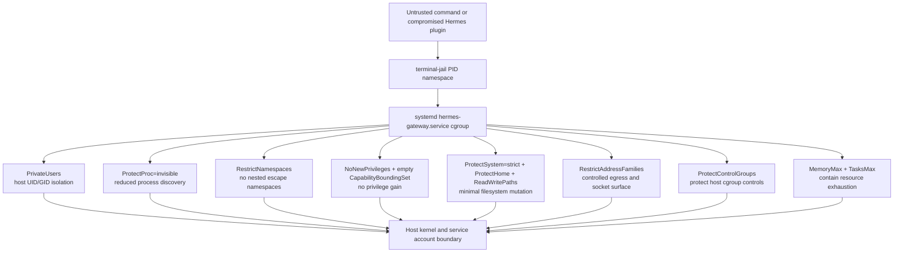

# systemd hardening for `hermes-gateway.service`

## Purpose and security boundary

`terminal-jail` uses a PID namespace to contain commands launched for Hermes Agent. That containment must not depend solely on the plugin or the CLI respecting its own policy. This drop-in applies a second, independently enforced boundary at the `systemd` service-manager layer:

- the gateway process and all of its descendants run with a smaller kernel-visible surface;
- they cannot acquire privilege through set-ID files or file capabilities;
- they cannot create a replacement set of namespaces to evade the intended sandbox topology;
- their filesystem writes and resource consumption are bounded; and
- networking is denied unless the deployment explicitly requires it.

This is defense in depth, not a substitute for patching Hermes, terminal-jail, or the host kernel. The host service account, filesystem ownership, AppArmor profile, and the service's existing unit configuration remain part of the trusted computing base.

## Applicability and assumptions

This specification targets a system service named `hermes-gateway.service` on Ubuntu 24.04 LTS (Noble) and Ubuntu 26.04 LTS. It assumes the service is run by a dedicated, unprivileged account and that persistent Hermes state is intentionally stored below `/var/lib/hermes`, logs below `/var/log/hermes`, and terminal-jail state below `/var/lib/terminal-jail`.

Do not copy the path list blindly. Before deployment, inspect the vendor unit, its environment files, and the live process paths. Every persistent path needed by Hermes, DuckBrain MCP, GitReins, or cron must be either under a listed writable directory or deliberately mounted/bound into the service. Keep secrets outside the writable paths whenever possible.

The network policy below is a **deny-network profile**. It is appropriate only when the gateway is reached through a Unix socket or a trusted local proxy/socket-activation arrangement and does not itself need outbound network access. A conventional TCP/HTTPS gateway normally needs `AF_INET` and/or `AF_INET6`; see [Network compatibility](#network-compatibility) before enabling this profile.

## Drop-in installation, load order, and precedence

Create the following directory and file on the host:

```text
/etc/systemd/system/hermes-gateway.service.d/90-terminal-jail-hardening.conf
```

`systemd` merges the vendor unit with drop-ins in lexical order. A drop-in in `/etc/systemd/system` has administrator precedence over one with the same name in `/usr/lib/systemd/system` (or `/lib/systemd/system` on Debian-family layouts). Within the same unit drop-in directory, `90-terminal-jail-hardening.conf` is applied after lower-numbered files and before higher-numbered files. It overrides scalar settings set earlier and appends to list settings unless the list is reset.

Use a high, non-`99` prefix so a site-specific emergency override can be installed later as, for example, `99-local-override.conf`. Do not edit the vendor service unit: package upgrades can replace it.

After installing or changing any drop-in, run `systemctl daemon-reload` before restarting the service. `daemon-reload` makes systemd re-read unit files; it does not restart the gateway by itself.

## Exact drop-in content

The following is the baseline drop-in. The `ReadWritePaths=` values are deliberately narrow and are the only durable write roots granted after `ProtectSystem=strict`. The service user must own only the directories it actually requires.

```ini
# /etc/systemd/system/hermes-gateway.service.d/90-terminal-jail-hardening.conf
# Defense-in-depth for terminal-jail / Hermes gateway.
# Review ReadWritePaths and RestrictAddressFamilies before deployment.

[Service]
# Namespace and process-visibility containment
ProtectProc=invisible
PrivateUsers=true
RestrictNamespaces=true

# Privilege containment
NoNewPrivileges=true
CapabilityBoundingSet=

# Network deny profile: retain AF_UNIX only. See the specification before use
# with a TCP/HTTPS gateway or a gateway needing outbound network access.
RestrictAddressFamilies=~AF_INET AF_INET6 AF_NETLINK

# Immutable operating-system view with explicit persistent write roots.
ProtectSystem=strict
ProtectHome=true
ReadWritePaths=/var/lib/hermes
ReadWritePaths=/var/log/hermes
ReadWritePaths=/var/lib/terminal-jail

# Protect the host cgroup hierarchy from a compromised descendant.
ProtectControlGroups=true

# Bound an agent loop or fork bomb before it can exhaust the host.
MemoryMax=1G
TasksMax=256
```

### Deliberate correction: `CloseOnExec=true`

Do **not** add `CloseOnExec=true` to this drop-in. It is not a valid `[Service]` hardening directive in the systemd versions shipped by the target Ubuntu releases, and it does not create or protect a cgroup namespace. Adding an unknown unit setting causes systemd to log an `Unknown lvalue` diagnostic and provides no security control.

`FD_CLOEXEC` is a per-file-descriptor flag enforced by `execve(2)`; it should be set by the program that opens a sensitive descriptor. If the concern is the host cgroup filesystem, the applicable systemd control is `ProtectControlGroups=true`, included above. It mounts the cgroup hierarchy read-only/inaccessible to the service as appropriate and prevents an escaped descendant from altering host cgroup controls. If the gateway deliberately uses cgroup delegation, `ProtectControlGroups=true` must be reviewed; it conflicts with the purpose of `Delegate=yes`.

For descriptor-passing services, separately audit the service's socket activation and `LISTEN_FDS` handling. Do not rely on a nonexistent systemd setting to prevent descriptor inheritance.

## Directive reference

| Directive | Baseline value | Minimum upstream systemd version | Rationale | Primary threat mitigated |
|---|---:|---:|---|---|
| `ProtectProc=` | `invisible` | 247 | Mounts a filtered `/proc` view so a process can see itself and permitted processes rather than enumerating unrelated host/service processes. | Process discovery, PID-based attacks, leakage of command lines and process metadata. |
| `PrivateUsers=` | `true` | 232 | Runs the service in a private user namespace with UID/GID mappings that make host identities unavailable to the process. This reduces the value of a compromised service UID. | Host-user impersonation and access based on host UID/GID identity. |
| `RestrictNamespaces=` | `true` | 231 | Denies creation of new namespaces through namespace-related clone/unshare/setns operations. systemd creates namespaces required by its own sandboxing before execution. | Building a nested user/mount/PID/network namespace to bypass assumptions or gain a new attack primitive. |
| `NoNewPrivileges=` | `true` | 187 | Sets `PR_SET_NO_NEW_PRIVS`; execs cannot gain privilege from setuid/setgid files or file capabilities. | Privilege escalation through a vulnerable or attacker-controlled executable. |
| `RestrictAddressFamilies=` | `~AF_INET AF_INET6 AF_NETLINK` | 228 | Deny-lists IPv4, IPv6, and netlink socket families while leaving local Unix-domain IPC available. | Exfiltration, remote command-and-control, port scanning, and network-configuration observation/manipulation. |
| `ProtectSystem=` | `strict` | 214 | Makes the service filesystem view read-only, including normally writable host locations, then relies on explicit write exceptions. `/dev`, `/proc`, and API filesystems have their own controls. | Tampering with executables, configuration, package-managed files, and arbitrary host paths. |
| `ProtectHome=` | `true` | 214 | Makes `/home`, `/root`, and `/run/user` inaccessible to the service. | SSH keys, cloud credentials, source trees, shell history, and other user-data disclosure/tampering. |
| `ReadWritePaths=` | three explicit roots | 231 | Re-opens only needed data, log, and jail-state roots after `ProtectSystem=strict`. Repeated directives append paths. | Broad write access becoming a persistence or configuration-tampering vector. |
| `CloseOnExec=` | **not used; invalid here** | N/A | Not a supported target-release service hardening directive and not a cgroup-namespace control. Use correct application-level `FD_CLOEXEC` discipline; use `ProtectControlGroups=` for cgroup protection. | Avoids a false security control caused by an unknown/ineffective setting. |
| `ProtectControlGroups=` | `true` | 214 | Protects the host cgroup hierarchy and is the correct substitute for the requested “cgroup namespace” goal. | Altering cgroup limits/accounting or observing/manipulating host cgroup state. |
| `MemoryMax=` | `1G` | 226 | Applies a cgroup v2 memory ceiling. Tune from observed gateway RSS plus a safe concurrency margin. | Host memory exhaustion and OOM cascades from runaway commands or agent loops. |
| `TasksMax=` | `256` | 226 | Caps the total processes/threads in the service cgroup. Tune for the Python runtime, worker pool, Git subprocesses, and expected concurrency. | Fork bombs, unbounded worker/thread creation, and PID exhaustion. |
| `CapabilityBoundingSet=` | empty assignment | 187 | An empty assignment clears the permitted capability bounding set for the service and its descendants. Capabilities cannot be regained after exec. | Kernel-privileged operations such as mount, raw networking, module loading, time changes, and DAC bypass. |

`CapabilityBoundingSet=` is intentionally an empty assignment, not `~CAP_SYS_ADMIN`. Dropping all capabilities is simpler to audit and avoids forgetting a less-obvious capability. If the vendor unit currently specifies `AmbientCapabilities=`, `CapabilityBoundingSet=` will make those capabilities unavailable; resolve that incompatibility rather than weakening the bounding set by default.

## Filesystem and state-path design

With `ProtectSystem=strict`, the gateway can write only to writable API filesystems such as `/run` and to explicitly allowed paths. The baseline permits three persistence classes:

| Path | Intended contents | Owner/mode guidance |
|---|---|---|
| `/var/lib/hermes` | Hermes durable data, including DuckBrain data if it is configured there | Dedicated gateway user; no other untrusted user writable. |
| `/var/log/hermes` | Gateway application logs when not using journald-only logging | Dedicated gateway user or an appropriate log group; do not make it world-writable. |
| `/var/lib/terminal-jail` | Terminal-jail persistent metadata and explicitly required state | Dedicated gateway user; keep runtime-only files in `/run`, not here. |

Prefer `RuntimeDirectory=hermes-gateway`, `StateDirectory=hermes`, and `LogsDirectory=hermes` in the vendor service when the package can support them. Those systemd-managed directories reduce path drift, but they are not added to this generic drop-in because directory ownership and the service's currently configured paths must be confirmed first.

Never solve a permission error by adding `/`, `/home`, `/etc`, `/usr`, or a broad parent such as `/var` to `ReadWritePaths=`. Narrow the write root to the actual store or create a dedicated directory instead.

## Network compatibility

`RestrictAddressFamilies=~AF_INET AF_INET6 AF_NETLINK` is strict: the process cannot create IPv4, IPv6, or netlink sockets. It may still use `AF_UNIX` sockets. This has important deployment consequences:

- A gateway that calls an LLM API, GitHub, a webhook, SMTP, DNS, or any TCP/UDP endpoint needs `AF_INET` and usually `AF_INET6` if IPv6 is enabled.
- A gateway that binds an HTTP/HTTPS listener itself needs the corresponding Internet socket family, even if it is behind a reverse proxy.
- GitReins may invoke Git hooks that use network-enabled tools; those operations will fail under this profile unless intentionally separated from the gateway service.
- DuckBrain MCP may be local and work over files or Unix sockets, but any remote embedding/store backend needs an Internet socket family.
- `AF_NETLINK` denial is desirable for a gateway: it prevents most direct network configuration/route inspection sockets. Do not re-enable it without a concrete requirement.

If the gateway must serve or call over IPv4 but not IPv6, replace the baseline line with:

```ini
RestrictAddressFamilies=AF_UNIX AF_INET
```

If it needs both IPv4 and IPv6, use:

```ini
RestrictAddressFamilies=AF_UNIX AF_INET AF_INET6
```

That allow-list form is easier to audit than a deny-list. Keep `AF_NETLINK` absent unless a validated dependency needs it. For the strongest separation, keep the hardened gateway on a Unix socket and put TCP termination, outbound proxying, and egress policy in a separately hardened service.

## Resource-limit sizing

`MemoryMax=1G` and `TasksMax=256` are safe starting points, not universal values. Measure the real gateway under normal and peak request load before production enforcement. Account for:

- the Python interpreter, gateway workers, terminal-jail descendants, and temporary Git processes;
- DuckBrain MCP indexing/embedding work and its peak resident memory;
- GitReins hooks, which can spawn formatters, linters, test runners, or child processes; and
- overlapping cron executions and webhook/request concurrency.

Keep `MemoryMax` low enough to protect the host but high enough to avoid turning normal request spikes into service-level OOM kills. For a small host, begin with a staging observation period and inspect `memory.current`, `memory.events`, `pids.current`, and `pids.events` in the service cgroup. Also consider `CPUQuota=` and `TimeoutStartSec=`/`TimeoutStopSec=` in a separate, workload-specific resource policy.

## Functional edge cases and required harmonization

### DuckBrain MCP

DuckBrain may need durable database/vector-index writes and may spawn a local helper. Locate its configured data directory before deployment. If it is below `/var/lib/hermes`, no extra exception is needed. If it is elsewhere, move the data into `/var/lib/hermes` or add that one exact directory to `ReadWritePaths=`. Do not allow the whole user home merely because a development configuration defaults there.

If DuckBrain contacts a remote model, database, or embedding service, the network deny profile will prevent it. Prefer a local backend or a narrowly scoped proxy service; otherwise use the explicit allow-list described in [Network compatibility](#network-compatibility).

### GitReins and Git hooks

GitReins hooks commonly need to read a checked-out repository and write within that repository's working tree or `.git` directory. Under `ProtectSystem=strict`, a repository outside a listed write root may be read-only or inaccessible. Keep service-operated repositories below a dedicated directory such as `/var/lib/hermes/workspaces` (already covered by `/var/lib/hermes`) and ensure only the service user owns it.

Do not grant broad write access to `/home/kara`, `/home`, or arbitrary developer repositories to make hooks pass. If a hook needs access to system tooling, it can still execute read-only binaries from `/usr`; if it needs package installation, system configuration, Docker, or a privileged daemon socket, it is incompatible with this threat model and must be redesigned or isolated into a separate, reviewed service.

### Cron state and scheduled jobs

Hermes cron schedules, run history, and lock/state files must be under an allowed persistent root. Use a subdirectory such as `/var/lib/hermes/cron` rather than a home-directory location, because `ProtectHome=true` intentionally hides user homes. Runtime-only PID files, sockets, and locks should be created under `/run/hermes-gateway` using a service-managed `RuntimeDirectory=` after verifying the vendor unit's design.

Prevent overlapping jobs at the application layer as well: `TasksMax` is a backstop, not a scheduler. A failed cron job caused by an access denial must be treated as a deployment defect, not fixed by broadly weakening the sandbox.

### `PrivateUsers=true` identity effects

A private user namespace can expose unmapped ownership (`nobody`/overflow IDs) for host files that are not mapped into the namespace. Test all bind mounts, state directories, and helper processes under the actual service user. Do not use `chmod 777` as a workaround. If a required host integration cannot work with private user mappings, split that integration into a minimal separate service rather than disabling `PrivateUsers` for the gateway wholesale.

### `RestrictNamespaces=true` and container tooling

This setting blocks `unshare`, `setns`, and namespace-creating clone flags from service descendants. Tools that try to launch containers, nested sandboxes, or build environments inside the gateway service may fail. That is the desired outcome for this security boundary. Run such tooling in a dedicated build/runner service with a separately reviewed policy; do not grant namespace creation to the internet-facing gateway merely for convenience.

## Compatibility matrix

Ubuntu package revisions vary over an LTS lifetime; verify the installed manager with `systemd --version`. Noble ships systemd 255, and the target controls below are all available there. Ubuntu 26.04 LTS ships a newer systemd release (257-series at initial release); all listed supported controls remain available. The exact package revision is less important than the `systemd` major version shown on the host.

| Control | Ubuntu 24.04 LTS (systemd 255) | Ubuntu 26.04 LTS (systemd 257-series) | Notes |
|---|---|---|---|
| `ProtectProc=invisible` | Supported | Supported | Requires systemd >= 247. |
| `PrivateUsers=true` | Supported | Supported | Requires systemd >= 232. |
| `RestrictNamespaces=true` | Supported | Supported | Requires systemd >= 231. |
| `NoNewPrivileges=true` | Supported | Supported | Requires systemd >= 187. |
| `RestrictAddressFamilies=` with `~` deny syntax | Supported | Supported | Requires systemd >= 228. |
| `ProtectSystem=strict` | Supported | Supported | Requires systemd >= 214. |
| `ProtectHome=true` | Supported | Supported | Requires systemd >= 214. |
| `ReadWritePaths=` | Supported | Supported | Requires systemd >= 231. |
| `ProtectControlGroups=true` | Supported | Supported | Correct cgroup-protection control; requires systemd >= 214. |
| `MemoryMax=` / `TasksMax=` | Supported | Supported | Requires systemd >= 226; needs cgroup v2 for the intended unified behavior. |
| Empty `CapabilityBoundingSet=` | Supported | Supported | Requires systemd >= 187. |
| `CloseOnExec=true` as a service hardening setting | Not supported | Not supported | Do not use; it is not the cgroup-namespace mechanism. |

On either release, `PrivateUsers`, `ProtectProc`, mount namespacing, and cgroup resource controls may be constrained by an unusual host/container environment. Verify on the actual target, not only in a development container. In particular, a containerized systemd manager may not be able to create the required namespaces or enforce cgroup limits delegated by its parent.

## Pre-deployment review and dry run

Perform these checks before copying the drop-in into `/etc`. They validate syntax and inspect the effective unit without restarting production traffic.

1. Inspect the vendor unit and all current drop-ins:

   ```bash
   systemctl cat hermes-gateway.service
   systemctl show -p User -p Group -p ExecStart -p EnvironmentFiles hermes-gateway.service
   ```

   Expected: identify the actual service account, executable, environment-file paths, and any existing sandboxing or `Delegate=` settings. Reconcile rather than duplicate conflicting settings.

2. Confirm all intended writable locations and remove development/home paths from the production design:

   ```bash
   systemctl show -p StateDirectory -p LogsDirectory -p RuntimeDirectory hermes-gateway.service
   sudo -u <gateway-user> test -w /var/lib/hermes
   sudo -u <gateway-user> test -w /var/log/hermes
   sudo -u <gateway-user> test -w /var/lib/terminal-jail
   ```

   Expected: each required directory is writable by the service user before the sandbox is enabled. `test` prints no output and exits `0` on success.

3. Validate syntax without starting the unit:

   ```bash
   sudo systemd-analyze verify /etc/systemd/system/hermes-gateway.service.d/90-terminal-jail-hardening.conf
   sudo systemd-analyze verify hermes-gateway.service
   ```

   Expected: no `Unknown lvalue`, parse error, missing executable, or dependency-cycle diagnostic. The first command catches drop-in syntax; the second validates the resolved unit known to systemd. If the unit name form is not accepted by the local `verify` version, use the full vendor-unit path together with the drop-in path.

4. Check the installed feature baseline:

   ```bash
   systemd --version
   ```

   Expected: `systemd 255` or later. A lower major version requires a per-directive compatibility review before deployment.

5. Stage the change on a non-production instance, then reload and restart:

   ```bash
   sudo install -d -m 0755 /etc/systemd/system/hermes-gateway.service.d
   sudo install -m 0644 90-terminal-jail-hardening.conf /etc/systemd/system/hermes-gateway.service.d/90-terminal-jail-hardening.conf
   sudo systemctl daemon-reload
   sudo systemctl restart hermes-gateway.service
   sudo systemctl --no-pager --full status hermes-gateway.service
   ```

   Expected: `Active: active (running)` and no access-denied, namespace, or address-family failures in the status output/journal. Do not execute this step until the preceding path and network reviews are complete.

## Verification checklist after deployment

Run all checks against the effective, loaded unit; do not infer success from the file merely existing.

- [ ] Confirm the merged unit contains the expected drop-in and that it won precedence:

  ```bash
  systemctl cat hermes-gateway.service
  ```

  Expected: an `[Service]` section from `/etc/systemd/system/hermes-gateway.service.d/90-terminal-jail-hardening.conf` appears after vendor content, with no later drop-in undoing it.

- [ ] Confirm the security-analyzer exposure score:

  ```bash
  systemd-analyze security hermes-gateway.service
  ```

  Expected: an overall exposure score of `9.0` or higher on the analyzer's 0–10 exposure scale (higher is better). The exact score is version-dependent and may remain below 10 because this specification intentionally does not force unrelated controls such as `SystemCallFilter=`, `PrivateDevices=`, `PrivateTmp=`, `LockPersonality=`, or `MemoryDenyWriteExecute=`. Treat a score below 9 as a review signal, not a reason to add settings without compatibility testing.

- [ ] Confirm all requested effective properties:

  ```bash
  systemctl show hermes-gateway.service \
    -p ProtectProc \
    -p PrivateUsers \
    -p RestrictNamespaces \
    -p NoNewPrivileges \
    -p RestrictAddressFamilies \
    -p ProtectSystem \
    -p ProtectHome \
    -p ReadWritePaths \
    -p ProtectControlGroups \
    -p MemoryMax \
    -p TasksMax \
    -p CapabilityBoundingSet
  ```

  Expected values:

  ```text
  ProtectProc=invisible
  PrivateUsers=yes
  RestrictNamespaces=yes
  NoNewPrivileges=yes
  RestrictAddressFamilies=AF_UNIX AF_...   # systemd's normalized display varies; AF_INET, AF_INET6, and AF_NETLINK are denied by the baseline
  ProtectSystem=strict
  ProtectHome=yes
  ReadWritePaths=/var/lib/hermes /var/log/hermes /var/lib/terminal-jail
  ProtectControlGroups=yes
  MemoryMax=1073741824
  TasksMax=256
  CapabilityBoundingSet=                 # empty
  ```

  `systemctl show` can normalize booleans and address-family masks differently across releases. Compare the effective behavior and absence of forbidden families, not just whitespace/order in its rendering.

- [ ] Confirm the service runs and observe sandbox denials immediately after a controlled request, cron run, DuckBrain operation, and GitReins hook invocation:

  ```bash
  journalctl -u hermes-gateway.service -b --no-pager
  ```

  Expected: normal startup and request handling with no `Permission denied`, `Operation not permitted`, `Failed to create namespace`, `Address family not supported by protocol`, or state-directory write errors. Any such error must be traced to the smallest missing capability/path/family; do not loosen a broad setting first.

- [ ] Confirm cgroup limits are attached to the running service:

  ```bash
  systemctl show hermes-gateway.service -p ControlGroup
  CG=$(systemctl show -p ControlGroup --value hermes-gateway.service)
  cat /sys/fs/cgroup"$CG"/memory.max
  cat /sys/fs/cgroup"$CG"/pids.max
  ```

  Expected: `memory.max` is `1073741824` and `pids.max` is `256`, unless an intentional site override changed the baseline. If those files do not exist, investigate cgroup hierarchy/delegation before claiming that resource limits are active.

- [ ] Confirm the network policy matches the intended operating mode. For the deny-network profile, test both the expected local Unix-socket workflow and an intentionally forbidden Internet operation from a controlled gateway code path. Expected: local workflow succeeds; attempts to create `AF_INET`, `AF_INET6`, or `AF_NETLINK` sockets fail. If TCP ingress/egress is a requirement, replace the deny profile with the narrow allow-list documented above and test the required paths explicitly.

## Defense-layer diagram



## Operational response to a failure

If the gateway fails after enabling the drop-in, capture the first denial from `journalctl -u hermes-gateway.service -b` and map it to one concrete dependency. Adjust only that dependency, preferably by moving its state into an existing approved root or isolating it into another service. Avoid these unsafe “fixes”:

- changing `ProtectSystem=strict` to `false`;
- changing `ProtectHome=true` to `false` to access a developer account;
- adding `/`, `/var`, or `/home` to `ReadWritePaths=`;
- enabling all network families because one endpoint was needed;
- retaining any capability “just in case”; or
- disabling `PrivateUsers`/`RestrictNamespaces` to accommodate container tooling in the gateway.

A deliberate exception should be documented with: the exact dependency, the smallest setting/path/family required, a test proving the dependency needs it, the owner who approved it, and a review date.
